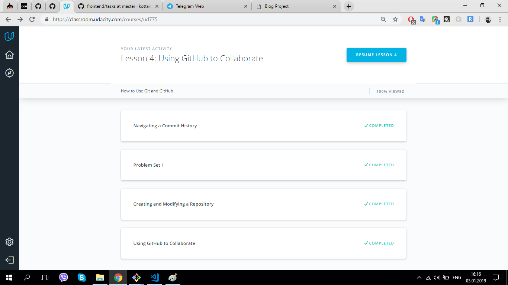

It is really useful material about git and GitHub.

## Git intro

Git and GitHub are perfect features, I'll use it.

## Linux CLI, and HTTP

Very interesting course about Bash Commandline,
but too heavy informations about HTTP Protocols.
