According to [Kottans Front-End Course](https://github.com/kottans/frontend/blob/master/contents.md)

<pre>  ᴧ_ᴧ
=(ᴧ.ᴧ)=
(")_(")</pre>

## My progress:

### General Basics

- [x] [Git Basics](https://github.com/kottans/frontend/blob/master/tasks/git-intro.md)
- [x] [Linux CLI and Networking](https://github.com/kottans/frontend/blob/master/tasks/linux-cli-http.md)
- [x] [VCS (hello gitty), GitHub and Collaboration](https://github.com/kottans/frontend/blob/master/tasks/git-collaboration.md)

### Front-End Basics

- [x] [Intro to HTML & CSS](https://github.com/kottans/frontend/blob/master/tasks/html-css-intro.md)
- [x] [Responsive Web Design](https://github.com/kottans/frontend/blob/master/tasks/html-css-responsive.md)
- [x] [HTLM & CSS Practice](https://github.com/kottans/frontend/blob/master/tasks/html-css-popup.md)
- [x] [JavaScript Basics](https://github.com/kottans/frontend/blob/master/tasks/js-basics.md)
- [x] [Document Object Model - practice](https://github.com/kottans/frontend/blob/master/tasks/js-dom.md)

### Advanced Topics

- [x] [Building a Tiny JS World (pre-OOP) - practice](https://github.com/kottans/frontend/blob/master/tasks/js-pre-oop.md)
- [ ] [Object oriented JS - practice](https://github.com/kottans/frontend/blob/master/tasks/js-oop.md)
- [x] [OOP exercise - practice](https://github.com/kottans/frontend/blob/master/tasks/js-post-oop.md)
- [ ] [Offline Web Applications](https://github.com/kottans/frontend/blob/master/tasks/app-design-offline.md)
- [ ] [Memory pair game — real project!](https://github.com/kottans/frontend/blob/master/tasks/memory-pair-game.md)
- [ ] [Website Performance Optimization](https://github.com/kottans/frontend/blob/master/tasks/app-design-performance.md)
- [ ] [Friends App - real project!](https://github.com/kottans/frontend/blob/master/tasks/friends-app.md)

## Git intro

[udacity.com - How to use Git and GitHub](./0_git_intro/udacity_git_intro.png)

Git and GitHub are perfect features, I'll use it.

## Linux CLI, and HTTP

[codecademy.com: Learn the Commant Line](./1_task_linux_cli/Completed.png)

Very interesting course about Bash Commandline,
but too heavy informations about HTTP Protocols.

## Git Collaboration

[udacity.com - Version Control with Git](./2_git_collaboration/what_is_version_control.png)

[udacity.com - GitHub and Collaboration](./2_git_collaboration/github_collaboration.png)

Mostly repiting of the Git intro at stage 0 with couple remarks.

## Intro to HTML and CSS

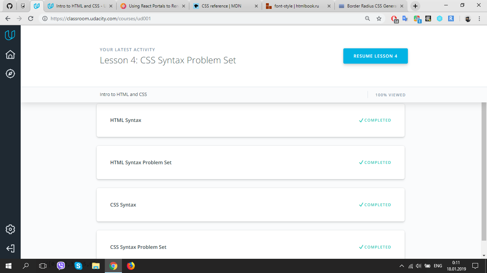

Some basic info.

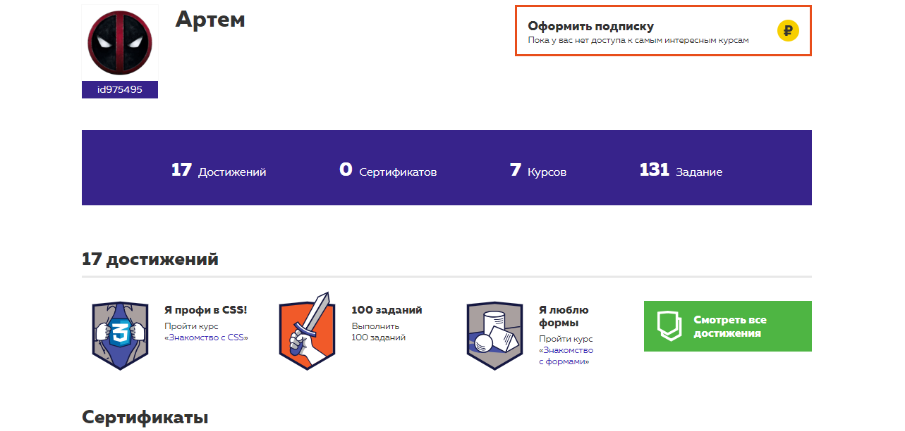

Very good free materials and lubs.

## Responsive Web Design

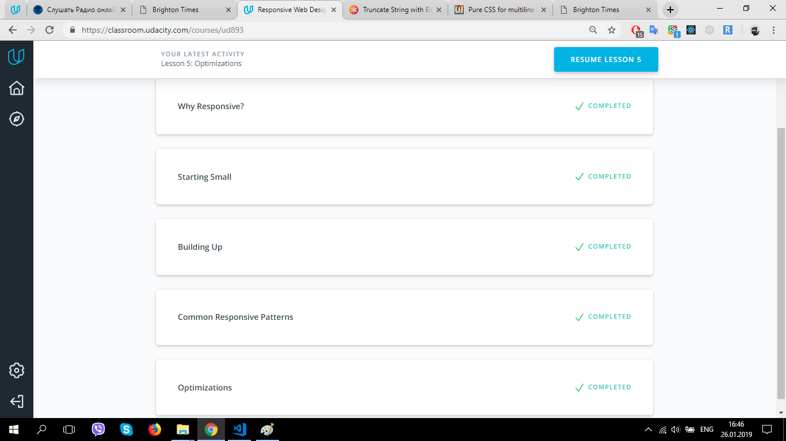

I've met a large number of sites on the network without any optimization for mobile devices, which makes it impossible to use them.
I hope the acquired knowledge will help to make the interface convenient for people.

[flexboxfroggy.com - CSS Game](./4_task_responsive_web_design/flexbox_froggy.png)

Funny game! :frog:

## HTLM & CSS Practice (Google popup menu)

[My project - #Demo](https://github.com/Temu4/Booble-popup)

## JS Basics

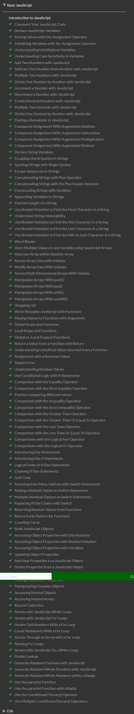

So many useful things about arrays and objects.

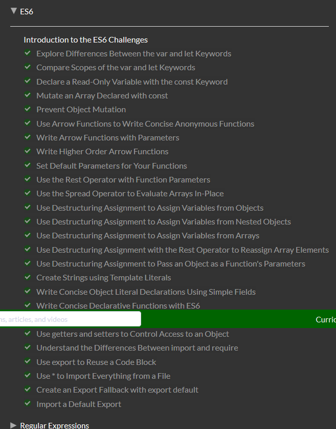

Array's functions, spread array method, class.

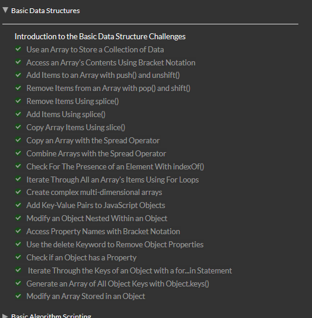

Topics about how to handle with objects ans arrays.

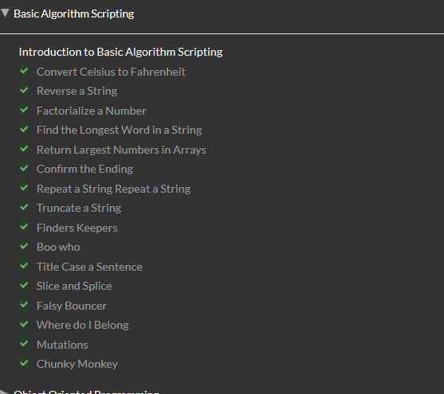

Tasks how to use your knowledge.
The execution of these tasks took me quite a long time, but it was worth it. Now I approach the solution of problems more pragmatically. Also I saved a lot of gists for my use.

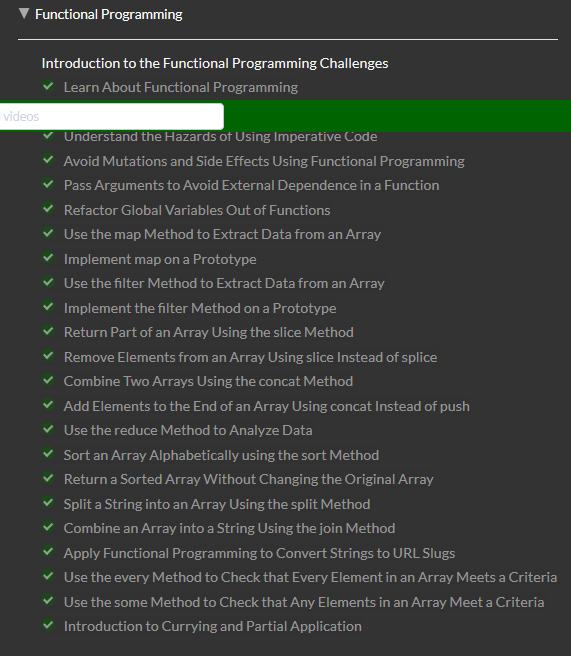

Good introductory material about principles of the functional programming. Also good practical taskts, durring which I worked with arrays methods. Also, I'm really happy that understand array.reduce() method! :notebook:

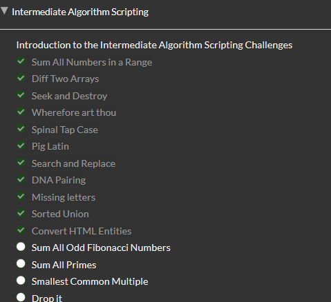

It took a lot of time to manage with String methods. Not all clear with RegExp.

## DOM

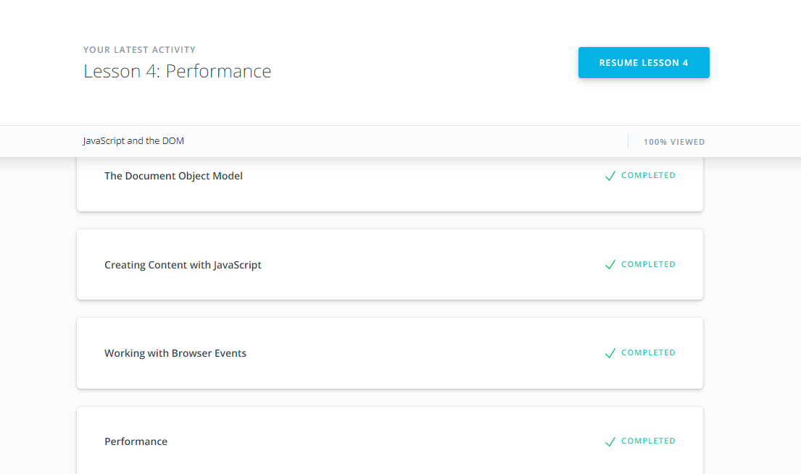

Learned so many tools to work with document. And understand what is javascript execution process of functions (Call Stack, Event Loop , Tasks)

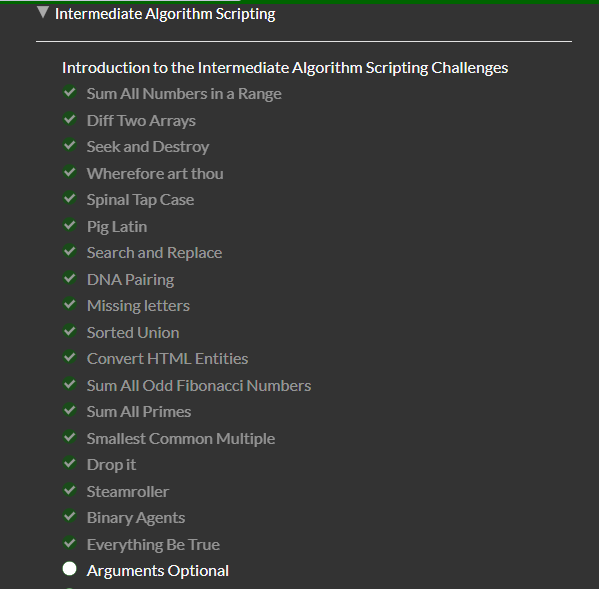

Perform my skills with arrays and strings.

### Practical task

[DOM - #Demo](https://temu4.github.io/weapons-explorer/)

## A Tiny JS World

[A Tiny JS World - #Demo](https://temu4.github.io/a-tiny-JS-world/)

## Object-Oriented JavaScript

[udacity - Object Oriented JavaScript](udacity-Object-Oriented-JavaScript.png)
The last task on udacity is beyond me :(

## OOP exercise (A Tiny JS World OOP)

[A Tiny JS World OOP - #Demo](https://temu4.github.io/a-tiny-JS-world-oop/)
