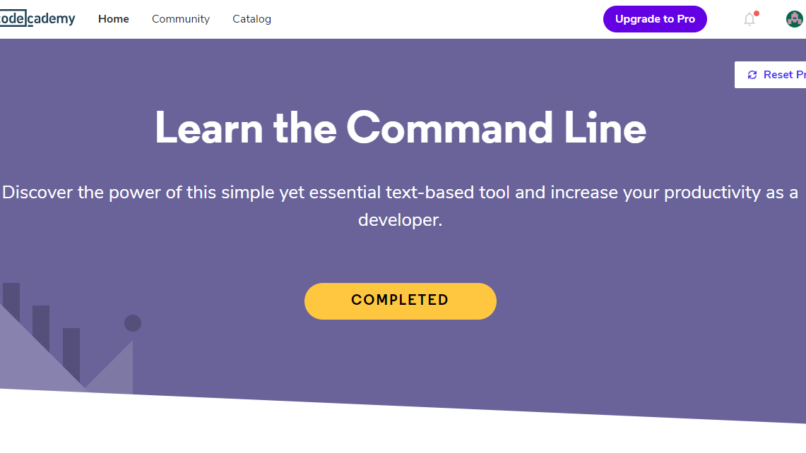
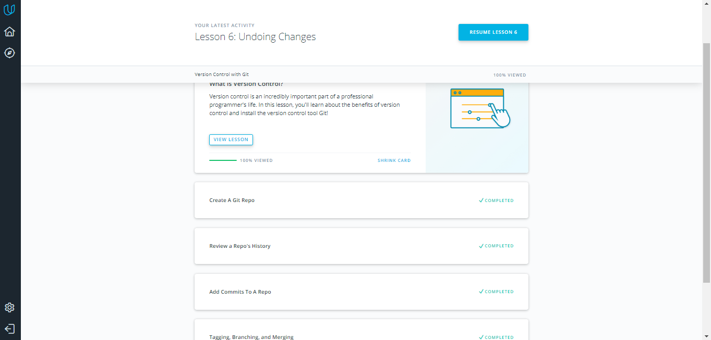
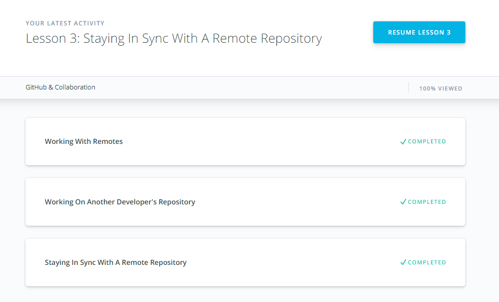

It is really useful material about git and GitHub.

##My progress:
###General Basics

- [x] Git Basics
- [x] Linux CLI and Networking
- [x] VCS (hello gitty), GitHub and Collaboration

###Front-End Basics

- [x] Intro to HTML & CSS
- [x] Responsive Web Design
- [ ] JavaScript Basics
- [ ] Document Object Model - practice

###Advanced Topics

- [ ] Building a Tiny JS World (pre-OOP) - practice
- [ ] Object oriented JS - practice
- [ ] OOP exercise - practice
- [ ] Offline Web Applications
- [ ] Memory pair game — real project!
- [ ] Website Performance Optimization
- [ ] Friends App - real project!

## Git intro

[How to use Git and GitHub](src="./0_git_intro/udacity_git_intro.png" "How to use Git and GitHub")

Git and GitHub are perfect features, I'll use it.

## Linux CLI, and HTTP

Very interesting course about Bash Commandline,
but too heavy informations about HTTP Protocols.

## Git Collaboration

Mostly repiting of the Git intro at stage 0 with couple remarks.
